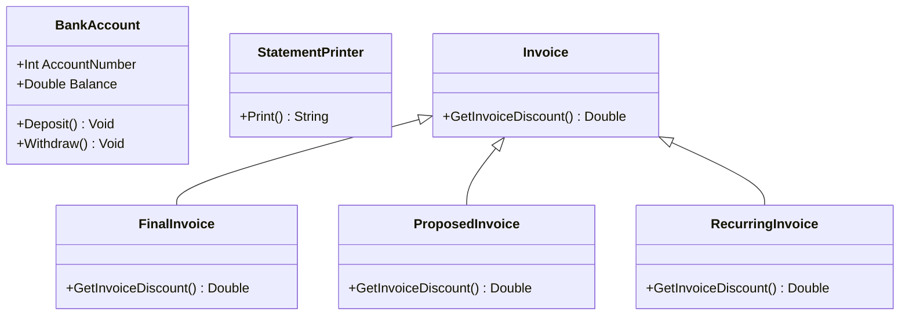

```mermaid
classDiagram

class BankAccount
BankAccount : +Int AccountNumber
BankAccount : +Double Balance
BankAccount : +Deposit() Void
BankAccount : +Withdraw() Void

class StatementPrinter
StatementPrinter : +Print() String

class Invoice
Invoice : +GetInvoiceDiscount() Double

class FinalInvoice
FinalInvoice : +GetInvoiceDiscount() Double

class ProposedInvoice
ProposedInvoice : +GetInvoiceDiscount() Double

class RecurringInvoice
RecurringInvoice : +GetInvoiceDiscount() Double


Invoice <|-- FinalInvoice
Invoice <|-- ProposedInvoice
Invoice <|-- RecurringInvoice

```
